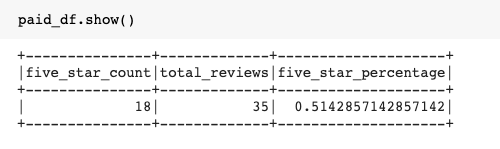
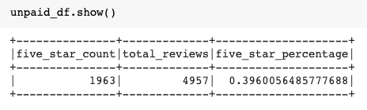

# Amazon_Vine_Analysis
Using PySpark to perform the ETL process and determine if there is any bias in the dataset.

## Overview of Project

### Purpose

### Resources
- Software:
- Data:

## Project Results

### Vine Reviews

- <strong>How many total Vine reviews?</strong> There were 35 total Vine reviews.
- <strong>How many 5-star Vine reviews?</strong> 18 of the Vine reviews were 5-star reviews.
- <strong>What percentage of Vine reviews were 5 stars?</strong> 51% of Vine reviews gave 5 stars. 

###### DataFrame of Results:

### Non-Vine Reviews

- <strong>How many total non-Vine reviews?</strong> There were 4957 total Vine reviews.
- <strong>How many 5-star non-Vine reviews?</strong> 1963 of the Vine reviews were 5-star reviews.
- <strong>What percentage of non-Vine reviews were 5 stars?</strong> 39% of Vine reviews gave 5 stars. 

###### DataFrame of Results:

## Summary

### Conclusion / Drawbacks

### Next Steps